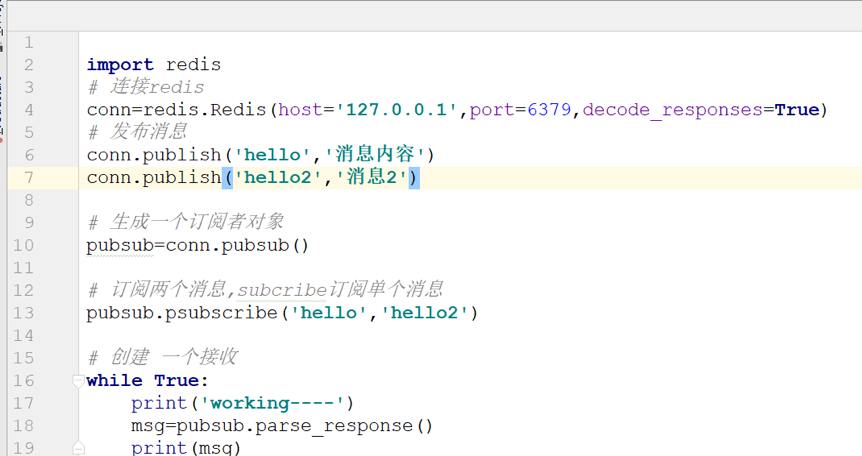

#如何基于redis实现发布订阅

什么是发布订阅

一种通信模型,它采用事件作为通信机制,提供大规模系统所要求的松散耦合交互模式,只能消费已订阅的信息

应用场景

公众号,微博,广播

优点

松耦合
可扩展性

缺点

发布者解耦订阅者
浪费内存
观察者与发布订阅模式有什么区别
观察者: 之间有耦合性,松耦合
发布订阅: 没有耦合性,通过第三个中间件进行交互

如何实现

一:  subscribe+publish 
优点:支持多端订阅,简单,性能高
缺点: 数据会丢失
01  发布消息:    publish  ‘ ’  返回值表示接受这条消息的订阅者数量,发出的消息不会持久化,只能接受订阅后的
02  订阅频道:   subscribe (‘’),返回值包括客户端订阅的频道,以及接收到的消息
03  取消订阅:   UNSUBSCRIBE   
 
发送消息:   publish channel:1 hello
 

案例:		 

