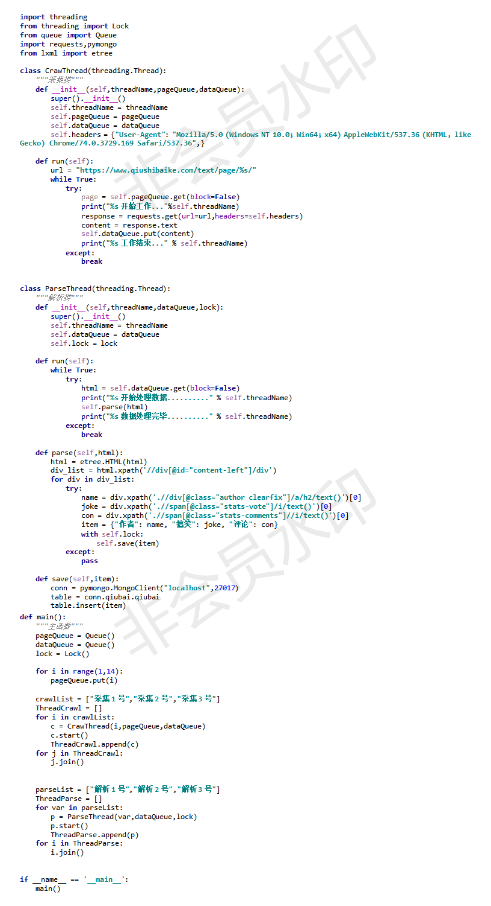
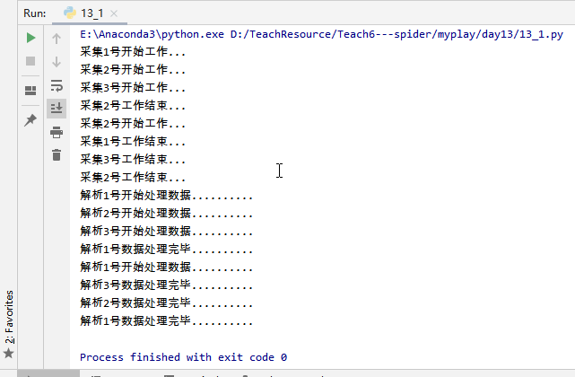

#为什么要使用生产者消费者模型

生产者指的是生产数据的任务，消费者指的是处理数据的任务，在并发编程中，如果生产者处理速度很快，而消费者处理速度很慢，那么生产者就必须等待消费者处理完，才能继续生产数据。同样的道理，如果消费者的处理能力大于生产者，那么消费者就必须等待生产者。为了解决这个问题于是引入了生产者和消费者模式。

#什么是生产者和消费者模式

生产者消费者模式是通过一个容器来解决生产者和消费者的强耦合问题，生产者和消费者彼此之间不直接通讯，而通过阻塞队列来进行通讯，所以生产者生产完数据之后不用等待消费者处理，直接扔给阻塞队列，消费者不找生产者要数据，而是直接从阻塞队列里取，阻塞队列就相当于一个缓冲区，平衡了生产者和消费者的处理能力。让它们之间可以不停的生产和消费。这个阻塞队列就是用来给生产者和消费者解耦。

简单点说，就好比餐馆的厨师和顾客，厨师作为生产者不断制作美味的食物，而顾客作为消费者不断食用厨师提供的食物。此外，生产者与消费者之间可以是一对一、一对多、多对一和多对多的关系。

##实现生产者消费者模型三要素

    1.生产者（负责造数据的任务）

    2.消费者（接收造出来的数据进行进一步的操作）

    3.队列（或其他的容器，但队列不用考虑锁的问题）

#什么时候用这个模型

程序中出现明显的两类任务，一类任务是负责生产，另外一类任务是负责处理生产的数据的（如爬虫）

#生产者消费者模式的优点
    1.解耦

假设生产者和消费者分别是两个线程。如果让生产者直接调用消费者的某个方法，那么生产者对于消费者就会产生依赖（也就是耦合）。如果未来消费者的代码发生变化，可能会影响到生产者的代码。而如果两者都依赖于某个缓冲区，两者之间不直接依赖，耦合也就相应降低了。

举个例子，我们去邮局投递信件，如果不使用邮箱（也就是缓冲区），你必须得把信直接交给邮递员。有同学会说，直接给邮递员不是挺简单的嘛？其实不简单，你必须 得认识谁是邮递员，才能把信给他。这就产生了你和邮递员之间的依赖（相当于生产者和消费者的强耦合）。万一哪天邮递员 换人了，你还要重新认识一下（相当于消费者变化导致修改生产者代码）。而邮箱相对来说比较固定，你依赖它的成本就比较低（相当于和缓冲区之间的弱耦合）。

    2.并发

    由于生产者与消费者是两个独立的并发体，他们之间是用缓冲区通信的，生产者只需要往缓冲区里丢数据，就可以继续生产下一个数据，而消费者只需要从缓冲区拿数据即可，这样就不会因为彼此的处理速度而发生阻塞。
继续上面的例子，如果我们不使用邮箱，就得在邮局等邮递员，直到他回来，把信件交给他，这期间我们啥事儿都不能干（也就是生产者阻塞）。或者邮递员得挨家挨户问，谁要寄信（相当于消费者轮询）。

    3.支持忙闲不均
    当生产者制造数据快的时候，消费者来不及处理，未处理的数据可以暂时存在缓冲区中，慢慢处理掉。而不至于因为消费者的性能造成数据丢失或影响生产者生产。

    我们再拿寄信的例子，假设邮递员一次只能带走1000封信，万一碰上情人节（或是圣诞节）送贺卡，需要寄出去的信超过了1000封，这时候邮箱这个缓冲区就派上用场了。邮递员把来不及带走的信暂存在邮箱中，等下次过来时再拿走。

    4.平衡了生产力与消费力

    平衡了生产力与消费力，就是生产者一直不停的生产，消费者可以不停的消费，因为二者不再是直接沟通的，而是跟队列沟通的。

#应用场景
    1.生产者消费者模型一般用于将复杂的业务逻辑异步化，多个线程来同时处理以提升系统的运行效率，典型的案例就是消息队列。
    2.此外，多线程爬虫也使用了生产者消费者模型。举一个例子就是我们的爬虫程序，我们都知道爬虫就是一次性的将网络上的数据快速的爬取下来并且放入本地计算机或者云端服务器供我们使用，那么我们的爬虫程序其实就是这样的一个生产者，但是我们知道计算机的性能和效率都很高，假如一个爬虫程序不停工作可以生产出大量的数据，但是我们的处理程序运行起来却不可能一次性处理这么多的程序，实在是放不下了只好先放在内存里面，但是越来越多的数据会导致内存被占满。
　　　　　　　　　生产者--->容器---->消费者
    这样就出现了一个容器我们占时管它叫做容器,我们有很多的生产者同时生产数据到容器中，然后消费者在从容器中取出进行数据清洗，这样我们可以有多个生产者同时生产提升了效率，同时也可以容纳多个消费者在容器上消费，这样的话就可以解决上面的问题了，同时：！！我们也可以引入多进程的工作进入了，生产者太少了的时候就多开几个进程生产，如果消费者的处理能力太弱了就多开几个进程同时处理这样就可以快很多了！

#伪代码
    1.多线程爬虫
    代码：
    

    打印：
    

    2.

'''
from multiprocessing import Process, Manager
import time

def create_data(q):
    # data_source用于模拟我们有1w条数据。
    data_source = (i for i in range(10000))
    # 读取数据
    for data in data_source:
        time.sleep(0.001)
        print('get data %s' % (data,))
        # 将读取的数据放入队列之中，，以方便别人来处理。
        q.put(data)
    # 1w条数据读取完后，将None作为结束信号放入队列中，告诉别人没数据了，可以结束了。
    q.put(None)

def handle_data(q):
    # 读取队列里的数据，并且处理他们。
    while True:
        # 队列的get方法，可以从队列里获取数据，他是阻塞的方法，如果队列中没有数据，他会一直等待。
        # 当然你也可以设置他的超时时间，一旦超时，会抛出Empty异常。非阻塞式的调用可以使用
        # q.get(False) 或者 q.get_nowait(), 当然队列没数据的话，他们也会抛Empty异常。
        data = q.get()
        # 是否处理完成
        if data == None:
            print('end')
            break
        time.sleep(0.002)
        # 处理数据，这里只是模拟了一下，象征性的每个数据乘了2，在具体的业务中，你可能会有其他处理数据的操作，
        # 比如将数据存入数据库等。
        result = data * 2
        print('handle data %s， result: %s' % (data, result))

if __name__ == '__main__':
    data_queue = Manager().Queue()
    # 创建一个生产者的进程，用于生产数据。
    producer = Process(target=create_data, args=(data_queue,))
    # 创建一个消费者的进程，用于处理数据。
    consumer = Process(target=handle_data, args=(data_queue, ))
    # 启动进程
    producer.start()
    consumer.start()
    # 使当前进程，也就是main进程，进入等待状态，当p进程都执行完毕后，
    # 当前进程才会继续下去运行。
    producer.join()
    consumer.join()
'''

    打印：部分截图
    
