#什么是队列？
队列是一种特殊的线性表，特殊之处在于它只允许在表的前端（front）进行删除操作，而在表的后端（rear）进行插入操作，和栈一样，队列是一种操作受限制的线性表。进行插入操作的端称为队尾，进行删除操作的端称为队头。

#什么是消息队列？
消息队列，用于存储还未被消费者消费的消息；
常见的6种RabbitMQ队列：
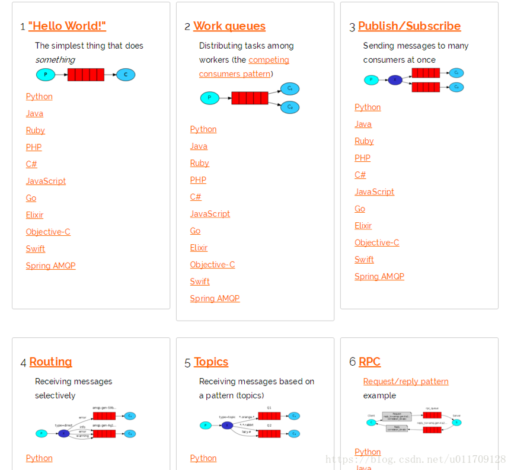
 
1、	简单队列模式：最简单的工作队列，其中一个消息生产者，一个消息消费者，一个队列。也称为点对点模式
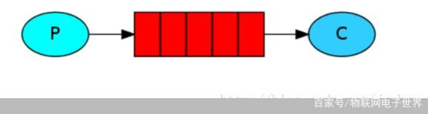
 
2、	竞争消费者模式：一个消息生产者，一个交换器，一个消息队列，多个消费者。同样也称为点对点模式
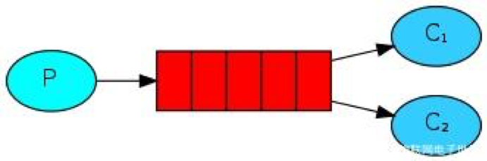
3、	发布/订阅模式：无选择接收消息，一个消息生产者，一个交换器，多个消息队列，多个消费者。称为发布/订阅模式
 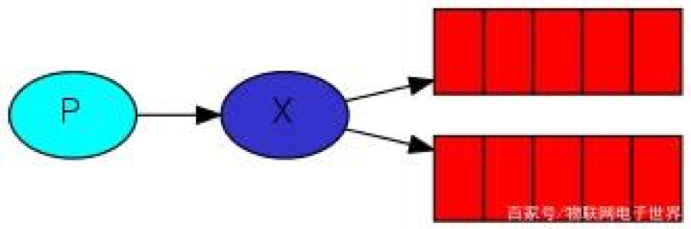
4、	Routing模式：在发布/订阅模式的基础上，有选择的接收消息，也就是通过routing进行匹配条件是否满足接收消息。
 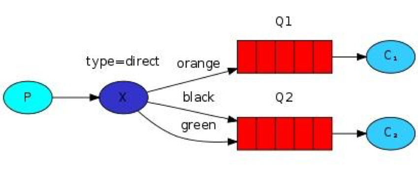
5、	主题模式：同样是在发布/订阅模式的基础上，根据主题匹配进行筛选是否接收消息，比第四类更灵活。
 
6、	RPC模式：与上面其他5种所不同之处，类模式是拥有请求/回复的。也就是有响应的，上面5种都没有。
 
#RabbitMQ存储和队列结构

存储原理

首先确认一个点，持久化和非持久化的消息都会落地磁盘，区别在于持久化的消息一定会写入磁盘(并且如果可以在内存中也会有一份)，而非持久化的消息只有在内存吃紧的时候落地磁盘。两种类型消息的落盘都是在RabbitMQ的持久层中完成的。

RabbitMQ的持久层只是一个逻辑上的概念，实际包含两个部分：

•	队列索引(rabbit_queue_index)：负责维护队列中落盘消息的信息，包括消息的存储地点、是否己被交付给消费者、是否己被消费者ack等。 每个队列都有与之对应的一个rabbit_queue_index

•	消息存储(rabbit_msg_store)：以键值对的形式存储消息，它被所有vhost中的队列共享，在每个vhost中有且只有一个。rabbit_msg_store具体还可以分为 msg_store_persistent和msg_store_transient，msg_store_persistent负责持久化消息的持久化，重启后消息不会丢失；msg_store_transient负责 非持久化消息的持久化，重启后消息会丢失。

消息(包括消息体、属性和headers)可以直接存储在rabbit_queue_index中，也可以被保存在rabbit_msg_store中。

最佳的配备方式是较小的消息存储在rabbit_queue_index中而较大的信息则存储在rabbit_msg_store中。消息大小的参数可以通过queue_index_embed_mgs_below来配置，默认大小4096，单位B。
rabbit_queue_index中以顺序的段文件来开始存储，后缀为".idx"，每个段文件中包含固定的SEGMENT_ENTRY_COUNT条记录，SEGMENT_ENTRY_COUNT默认值是16384。
经过rabbit_msg_store处理的所有消息都会以追加的方式写入到文件中，当一个文件的大小超过指定的限制(filesizelimit)后，关闭这个文件再创建一个新的文件以供新的消息写入。文件名(文件后缀是".rdq")从0开始进行累加，因此文件名最小的文件也是最老的文件。在进行消息的存储时，RabbitMQ会在ETS(Erlang Term Storage)表中记录消息在文件中的位置映射(Index)和文件的相关信息(FileSummary)。
在读取消息的时候，先根据消息的ID(msg id)找到对应存储的文件，如果文件存在并且未被锁住，则直接打开文件，从指定位置读取消息的内容。如果文件不存在或者被锁住了，则发送请求由rabbit_msg_store进行处理。
消息删除是只是删除ETS表中该消息的相关信息，同时更新消息对应的存储文件的相关信息。执行消息删除操作时，并不立即对文件中的消息进行删除，也就是说消息依然在文件中，仅仅是被标识为垃圾数据而已。一个文件中都是垃圾数据时可以将这个文件删除。当检测到前后两个文件中的有效数据可以合并在一个文件中，并且所有的垃圾数据的大小和所有文件(至少有3个文件存在的情况下)的数据大小的比值超过设置的阀值GARBAGE FRACTION(默认值为0.5)时才会触发垃圾回收将两个文件合并。

#队列结构
通常队列由rabbit_amqpqueue_process和backing_queue两部分组成：
•	rabbit_amqpqueue_process：负责协议相关的消息处理(即接收生产者发布的消息、向消费者交付消息、处理消息的确认(包括生产端的confirm和消费端的ack))等
•	backing_queue：消息存储的具体形式和引擎，并向rabbit_amqpqueue_process提供接口以供调用
如果消息发送的队列是空的且队列有消费者，该消息不会经过该队列直接发往消费者，如果无法直接被消费，则需要将消息暂存入队列，以便重新投递。消息在存入队列后，主要有以下几种状态：
•	alpha：消息内容(包括消息体、属性和headers)和消息索引都存在内存中
•	beta：消息内容保存在磁盘中，消息索引都存在内存中
•	gamma：消息内容保存在磁盘中，消息索引在磁盘和内存中都存在
•	delta：消息内容和消息索引都在磁盘中
持久化的消息，消息内容和消息索引必须都保存在磁盘中，才会处于上面状态中的一种，gamma状态只有持久化的消息才有这种状态。
对于没有设置优先级和镜像的队列来说，backing_queue的默认实现是rabbit_variable_queue，其内部通过5个子队列来体现消息的各个状态：
•	Q1：只包含alpha状态的消息
•	Q2：包含beta和gamma的消息
•	Delta：包含delta的消息
•	Q3：包含beta和gamma的消息
•	Q4：只包含alpha状态的消息
消息的状态一般变更方向是Q1->Q2->Delta->Q3->Q4，大体是从内存到磁盘然后再到内存中。
 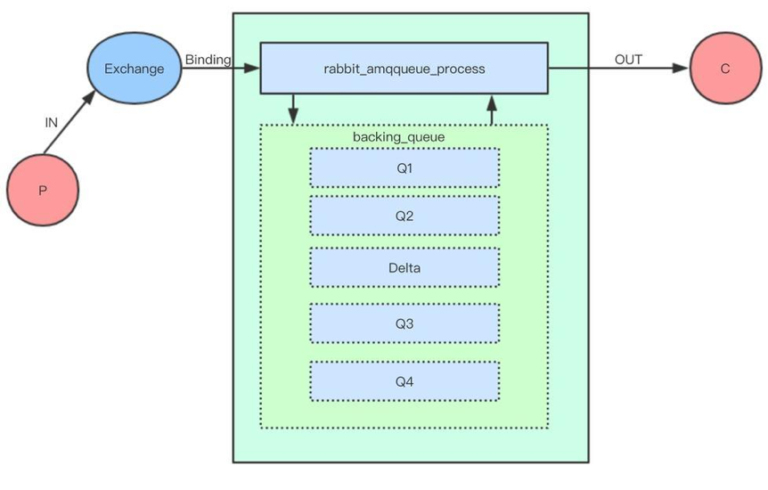
#消费者消费消息也会引起消息状态的转换。
1.	消费者消费时先从Q4获取消息，如果获取成功则返回。

2.	如果Q4为空，则从Q3中获取消息，首先判断Q3是否为空，如果为空返回队列为空，即此时队列中无消息

3.	如果Q3不为空，取出Q3的消息，然后判断Q3和Delta中的长度，如果都为空，那么Q2、Delta、Q3、Q4都为空，直接将Q1中的消息转移至Q4，下次直接从Q4中读取消息

4.	如果Q3为空，Delta不为空，则将Delta中的消息转移至Q3中，下次直接从Q3中读取。

5.	在将消息从Delta转移至Q3的过程中，是按照索引分段读取，首先读取某一段，然后判断读取的消息个数和Delta消息的个数，如果相等，判定Delta已无消息，直接将读取 Q2和读取到消息一并放入Q3，如果不相等，仅将此次读取的消息转移到Q3。
通常在负载正常时，如果消息被消费的速度不小于接收新消息的速度，对于不需要保证可靠不丢失的消息来说，极有可能只会处于alpha状态。对于durable属性设置为true的消息，它一定会进入gamma状态，并且在开启publisher confirm机制时，只有到了gamma状态时才会确认该消息己被接收，若消息消费速度足够快、内存也充足，这些消息也不会继续走到下一个状态。
惰性队列
惰性队列会将接收到的消息直接存入文件系统中，而不管是持久化的或者是非持久化的，这样可以减少了内存的消耗，但是会增加I/0的使用，如果消息是持久化的，那么这样的I/0操作不可避免，惰性队列和持久化的消息可谓是"最佳拍档"。
队列具备两种模式：default和lazy。在队列声明的时候可以通过x-queue-mode参数来设置队列的模式，取值为default和lazy。对应的 Policy设置方式为:
rabbitmqctl set_policy lazy "^myQueue$" '{"queue-mode":"lazy"}' --apply-to queue

Redis也可用作消息队列。
它的列表类型天生支持用作消息队列。
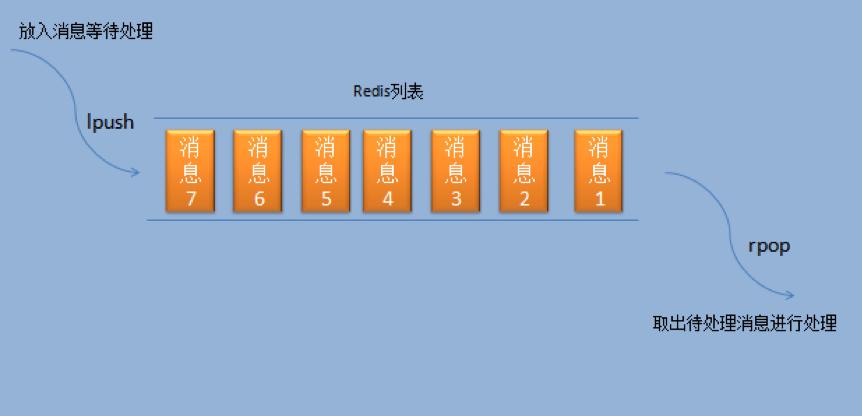

三、redis做消息队列及问题: 

redis的list类型天生支持用作消息队列。可以由生产消费模型,发布订阅模式实现消息队列.由于redis的list是使用双向链表实现的，保存了头尾节点，所以在列表头尾两边插取元素都是
非常快的。所以可以直接使用redis的list实现消息队列，只需简单的两个指令lpush和rpop或者rpush和lpop。 
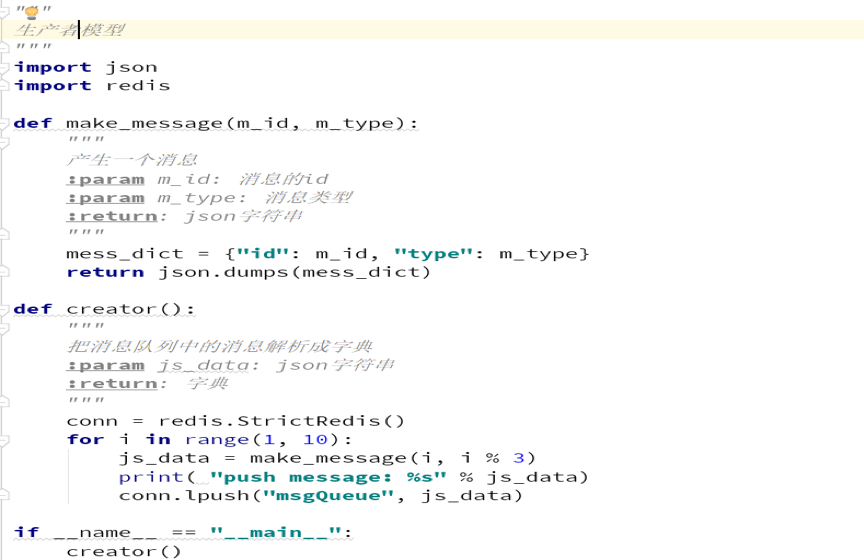
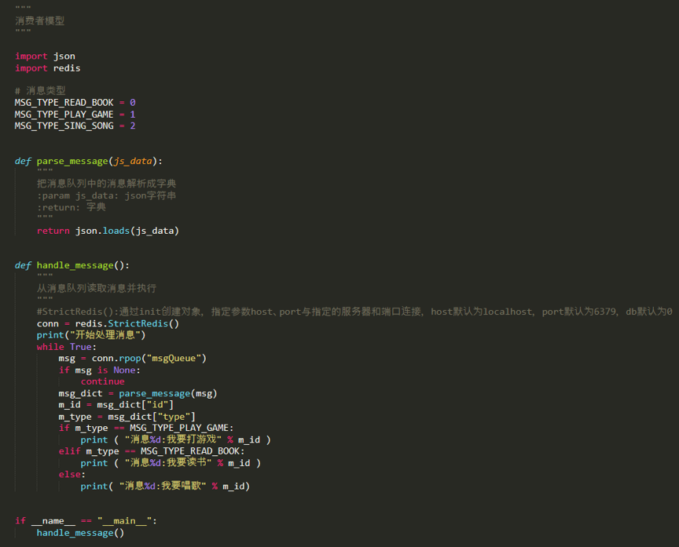
## 根据不同的消息类型去做不同的消息处理
输出的结果: 
开始处理消息
消息1:我要打游戏
消息2:我要唱歌
消息3:我要读书
消息4:我要打游戏
消息5:我要唱歌
消息6:我要读书 ... ...
以上实现原理非常简单，但是由于消费者取消息是循环实现的，所以会出现如下问题：
1.	需要考虑消费者拿到空消息的情况（输出结果中出现了null）。
2.	如果生产者速度大于消费者消费速度，消息队列长度会一直增大，时间久了会占用大量内存空间。
3.	消费者存在资源浪费的情况。
解决办法就是使用reids 的阻塞读取命令BRPOP来改进消费者demo,
同样也能和上面一样完成同样的功能，只是和上面不同的是，这里读取消息不会一直循环去读取，而是一直阻塞，等到有消息过来才读取:
def handle_message():
 	... 
#这里使用BRPOP进行阻塞式读取
while True: msg = conn.brpop("msgQueue")[1] 
msg_dict = parse_message(msg)
 ...
当然在某些业务的需求下 需要我们优先执行队列, 依旧可以使用BRPOP 来这是优先级队列的  执行顺序.
详解:https://www.php.cn/python-tutorials-374499.html

四、redis做消息队列应用场景:
消息队列一个消息的链表，是一个异步处理的数据处理引擎。不仅能够提高系统的负荷，还能够改善因网络阻塞导致的数据缺失。一般用于邮件发送、手机短信发送，数据表单提交、图片生成、视频转换、日志储存等。
Celer+redis+django 实现异步发邮件:
https://www.cnblogs.com/wumingxiaoyao/p/8515075.html

五、Rabbitmq 消息队列
基于Contos 下 怎么安装以及python做rabbitmq消息队列详解:
https://www.cnblogs.com/dongxiaodong/p/10495941.html

六、redis 和  rabbitmq  做消息队列 他两之间的区别?

可靠消费

Redis：没有相应的机制保证消息的消费，当消费者消费失败的时候，消息体丢失，需要手动处理
RabbitMQ：具有消息消费确认，即使消费者消费失败，也会自动使消息体返回原队列，同时可全程持久化，保证消息体被正确消费

可靠发布

Reids：不提供，需自行实现
RabbitMQ：具有发布确认功能，保证消息被发布到服务器

高可用

Redis：采用主从模式，读写分离，但是故障转移还没有非常完善的官方解决方案
RabbitMQ：集群采用磁盘、内存节点，任意单点故障都不会影响整个队列的操作

持久化

Redis：将整个Redis实例持久化到磁盘
RabbitMQ：队列，消息，都可以选择是否持久化

消费者负载均衡

Redis：不提供，需自行实现
RabbitMQ：根据消费者情况，进行消息的均衡分发

队列监控

Redis：不提供，需自行实现
RabbitMQ：后台可以监控某个队列的所有信息，（内存，磁盘，消费者，生产者，速率等）

流量控制

Redis：不提供，需自行实现
RabbitMQ：服务器过载的情况，对生产者速率会进行限制，保证服务可靠性

出入队性能

对于RabbitMQ和Redis的入队和出队操作，各执行100万次，每10万次记录一次执行时间。
测试数据分为128Bytes、512Bytes、1K和10K四个不同大小的数据。
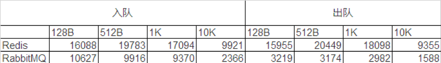

应用场景分析

Redis：轻量级，高并发，延迟敏感
即时数据分析、秒杀计数器、缓存等

RabbitMQ：重量级，高并发，异步
批量数据异步处理、并行任务串行化，高负载任务的负载均衡等

Rabbitmq怎么保证可靠性?
目前来说，现在有两种方案实施： 
1.	数据库持久化方案 
生产者：
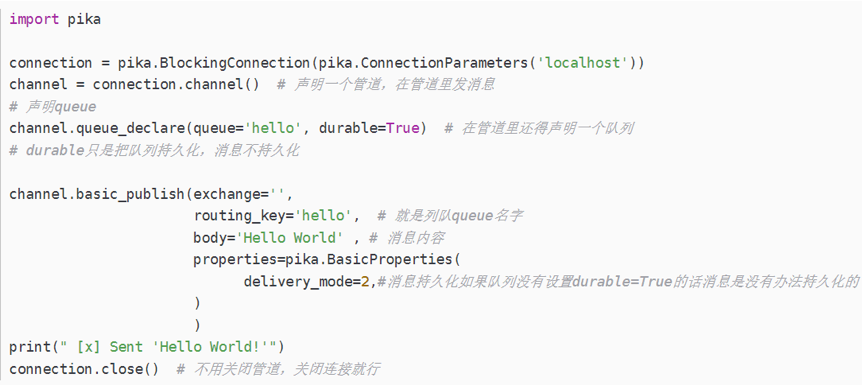
消费者:
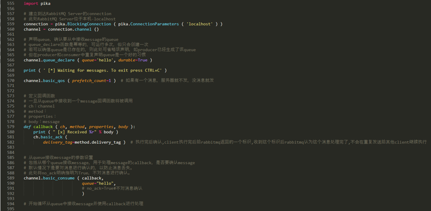

2.	消息延迟投递方案
https://blog.csdn.net/weixin_43437629/article/details/87196729
2.Rabbitmq怎么进行消息的均衡分发?
如果Rabbit只管按顺序把消息发到各个消费者身上，不考虑消费者负载的话，很可能出现，一个机器配置不高的消费者那里堆积了很多消息处理不完，同时配置高的消费者却一直很轻松。为解决此问题，可以在各个消费者端，配置perfetch=1,意思就是告诉RabbitMQ在我这个消费者当前消息还没处理完的时候就不要再给我发新消息了。

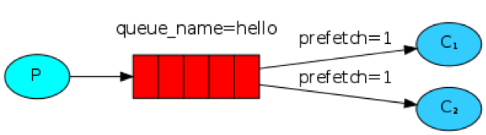
	 
也就是说在消息消费之前 我们得加上(上面demo中以及提到):
	channel.basic_qos(prefetch_count=1)  

如何基于redis实现消息队列
一 : 什么是消息队列(中间件)
队列: 一种先进先出的数据结构
消息队列可以简单理解为: 生产者将要传输的数据放在队列中,消费者从消息队列中取出执行,互相不存在任何联,
一种应用间的通信方式 
二 : 为什么要用消息队列
1:   解耦: 比如当系统A可以生产一个userld,系统B系统C想要使用userld的时候,需要通知系统A,系统A进行连接B和C,当不需要的时候B和C通知A,A进行断开连接,假如系统C挂了,A还得想办法处理,,A始终在来回改来改去,没有一点价值,当系统A使用消息队列,将信息存储到消息队列中,B和C需要使用的时候直接获取队列中的信息使用即可,A不用关心B和C出现的问题,实现解耦
2:   异步: 提高用户体验和吞吐量,不使用消息队列时候A需要等待每一个系统操作,一个成功操作下一个,使用队列只需要将信息放入队列,即取做其他的事情
3:    削峰/限流:   假如每月都有一次促销活动,每秒有3000个请求,B和C每秒只能处理1000个,剩余的1000个可能就会造成系统奔溃,使用队列,将请求放入队列中,B和C操作完上一个,取出下一个进行执行,不会出现系统奔溃
实现高性能,高可用,可伸缩和最终一致性结构

四 : 使用redis实现消息队列有什么问题 
1:   高可用 : 如果消息队列是单机的,当这台机器挂了,那么整个系统就不可用了,所以得采用集群/分布式,要做集群分布式就希望该消息队列提供现成的支持,而不需要自己手动去实现.
2:   数据丢失: 假如A刚将信息放到队列上,B和C还没有来得及取,队列就挂了,这样数据就丢失了,需要将数据存放在别的地方,减少数据的丢失,
4:   提高了系统的复杂性,
6:   如何保证消息绝对有序
7:   系统可用性降低---例如没有加队列的时候其他程序
不能重复消费
不支持分组消费,需要在自己的业务逻辑层解决
不能做广播模式
做消费者ack比较麻烦
五 :  redis消息队列应用
例如:   在用户点击下单之后,执行扣减库存,生成相应的单据,发红包,发短信,在业务量大的时候可以将流程分开处理,比如在扣减库存和生成相应的单据之后,给队列发送一个消息,另外一条线程获取消息队列的消息,执行相应的业务逻辑.
用于异步,解耦
计费系统,
适合轻量高并发的情况,比如秒杀,即时数据分析等
邮件发送,短信发送,数据表单提交,图片生成,视频转换,日志存储
六 : 其他常用队列
单机吞吐量
RabbitMQ	  万级    必须搭建一个服务器
ActiveMQ    万级
RocketMQ    10万级
Kafka        10万级
Disque
zeroMQ
七 : 常见问题 
1  消息队列满了以后怎么处理
临时写程序,接入数据消费,消费一个丢弃一个,快速消费掉所有消息,然后走第二个方案,晚上补数据
2   队列数据丢失
1  生产者往mq写数据丢失
开启事务:  缺点---降低吞吐量(同步事务会阻塞)
开启confirm , 异步ack机制(失败消息重发)
2  mq丢数据(比如bang机)
3  消费者丢数据(消费者邦机)
Rabbitmq提供的ack机制,(但是要关闭rabitmq的自动机制,当consumer处理完消息之后手动ack)
6   如何实现即时消费
 		列表的阻塞式弹出,发布订阅模式
7   如何实现ack机制
解: ack即小气确认,当消费者消费成功之后给生产者返回一个,ack消息,告知某条消息已被成功处理,就可以从队列中移除了,如果没有发送或发送失败,broker会认为消息处理失败,会将此消息及后续消息发给其他消费者进行处理
Worker处理失败,进行回滚
当list没有消息时候,进行阻塞,
八 : 支持什么模式
发布订阅模式
生产消费模式
消费者如何获取队列中的数据,
1  生产者将消息放到队列中,消息队列有数据了,主动叫消费者去拿,(push)
2  消费者不断地轮训消息队列,有数据即进行消费(pull)
九  :  具体实现方案 
01   基于list的LPUSH+BRPOP实现
简介:
基于链表实现,单线程方式处理客户端请求,提供前后插入消息,阻塞读取BLPOP和BRPOP
命令:
LPUSH:   生产者将消息从左侧放入队列
BRPOP:   阻塞模式,消费者从右侧消费消息
优点:
1.  实现简单
2.  Redis支持持久化消息,意味着消息不会丢失,可以重复查看(只看不用)
3.  可以保证顺序性,保证使用LPUSH命令,可以保证消息的顺序性
4.  使用RPUSH,可以将消息放在队列的开头,达到优先消息的目的
缺点:
1.  做消费确认ACK比较麻烦,不能保证消费在读取知否,未处理的邦机问题,导致消息意外丢失,通常需要自己维护一个pending列表,保证消息的处理确认
2.  不能做广播模式
3.   不能重复消费,一旦消费就会被确认
4.   不支持分组消费,需要自己在业务逻辑层解决
实现代码:
01.   连接redis
三种连接方式  1使用库中的Redis类(StrictRedis类),2使用ConnectionPool连接池(可保持长连接)3使用Sentinel类(如果有多个redis做集群时,程序会自己选择一个合适的连接)
Re_data=Redis.Redis(host=’localhost’,port=6379)
02.   写入消息队列
03.   取出消息,执行
 
 
 
02   PUB/SUB,订阅/发布模式
简述:
不适合做消息存储,擅长广播通信,即时通信,即时反馈的业务
命令:
SUBSCRIBE     用于订阅频道
PUBLISH       向频道发送消息
UNSUBSCRIBE       取消订阅
优点:
1.  广播模式,一个消息可以发布到多个消费者
2.  消费者可以订阅多个频道,接收多类消息
3.   消息即时发送,不用等待消费者读取
缺点:
1.   如果发布消息是客户端不在线,消息就会丢失
2.   如果客户端出现积压,到一定成度,会被强制断开,导致消息丢失
案例:
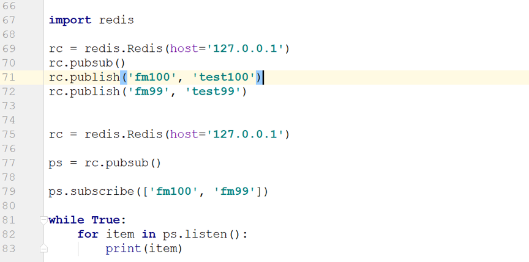
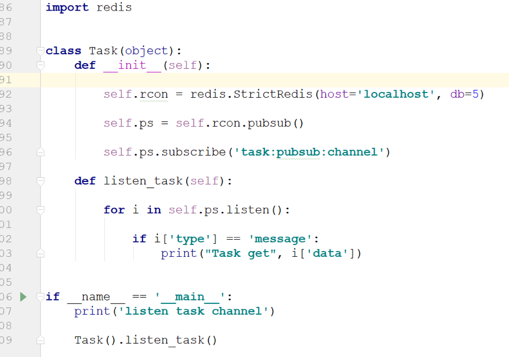
 
03  基于stream类型的实现
简介:
 		redis5.0发布的stream类型,也用来实现消息对			列,几乎满足了消息队列具备的全部内容,博客推荐https://blog.csdn.net/enmotech/article/details/81230531
优点:
支持自动生成消息id,分组消费,ack机制,消息转移,队列监控等核心消息队列功能
生产消息:  XADD
语法:  XADD key ID field string [field string .....]
提供key:
消息ID:   为方案,常用*,表示由redis生成消息id,由两部分组成,时间戳-序号,单调递增,有序
Field string [field string...]为内容,类型为key_value,由一个或者多个key_value组成

消费消息:   XREAD
语法:XREAD [COUNT count] [BLOCK milliseconds]STREAMS key [key ...] ID [ID...]
[COUNT count],用于限定获取的消息数量
[BLOCK millisecondds],用于设置为阻塞模式,默认非阻塞模式
ID 用于设置由那个消息id开始读取
在阻塞模式中,使用$,表示最新的消息id
阻塞模式用法:
XREAD block 1000 streams memberMessage $
Stream数据结构:
基于 radixTree数据结构实现的

十 : 阻塞模式与非阻塞模式
01   阻塞模式    (只有阻塞读,没有阻塞写)
 当消息队列中没有任何元素可以弹出的时候,连接进行阻塞,避免消费者轮询占用资源,当有元素时立即执行处理,使用BLPOP 和 BRPOP实现
02   非阻塞模式
即保持长连接

