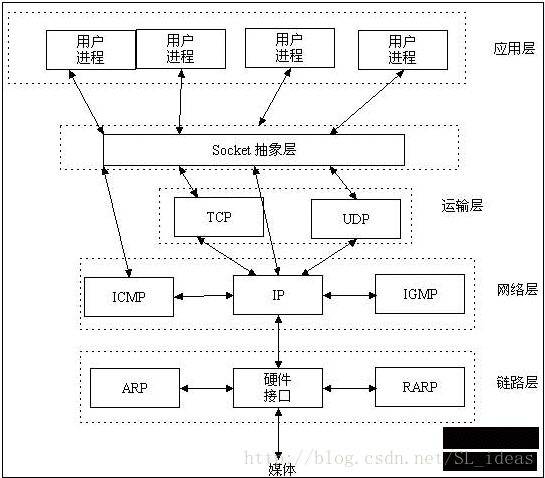
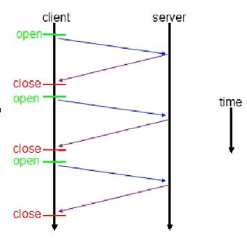
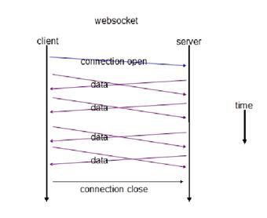

# **什么是WebSocket**

WebSocket是HTML5规范提出的一种协议；目前除了完犊子的IE浏览器，其他浏览器都基本支持。他是一种协议，万变不离其宗，也是基于TCP协议的；和HTTP协议是并存的两种协议。 

WebSocket是HTML5中的协议。HTML5 Web Sockets规范定义了Web Sockets API，支持页面使用Web Socket协议与远程主机进行全双工的通信。它引入了WebSocket接口并且定义了一个全双工的通信通道，通过一个单一的套接字在Web上进行操作。HTML5 Web Sockets以最小的开销高效地提供了Web连接。相较于经常需要使用推送实时数据到客户端甚至通过维护两个HTTP连接来模拟全双工连接的旧的轮询或长轮询（Comet）来说，这就极大的减少了不必要的网络流量与延迟。 

要使用HTML5 Web Sockets从一个Web客户端连接到一个远程端点，你要创建一个新的WebSocket实例并为之提供一个URL来表示你想要连接到的远程端点。该规范定义了ws://以及wss://模式来分别表示WebSocket和安全WebSocket连接,这就跟http:// 以及https:// 的区别是差不多的。一个WebSocket连接是在客户端与服务器之间HTTP协议的初始握手阶段将其升级到Web Socket协议来建立的，其底层仍是TCP/IP连接。

# **WebSocket的特点**

（1）服务端可以主动推送信息，属于服务器推送技术的一种。

 

（2）建立在TCP协议之上，服务端的实现比较容易。

 

（3）与HTTP协议有着良好的兼容性，默认端口也是80和443，并且握手阶段采用HTTP协议，因此握手时不容易屏蔽，能通过各种HTTP代理服务器。

 

（4）数据格式比较轻量，性能开销小，通信高效。

 

（5）可以发送文本，也可以发送二进制数据。

 

（6）没有同源限制，客户端可以与任意服务器通信。

 

（7）协议标识符是ws（如果加密，则为wss），服务器网址就是URL。

 

 

#### **WebSocket与Socket的关系**

 

Socket其实并不是一个协议，而是为了方便使用TCP或UDP而抽象出来的一层，是位于应用层和传输控制层之间的一组接口。

 

“Socket是应用层与TCP/IP协议族通信的中间软件抽象层，它是一组接口，提供一套调用TCP/IP协议的API。在设计模式中，Socket其实就是一个门面模式，它把复杂的TCP/IP协议族隐藏在Socket接口后面，对用户来说，一组简单的接口就是全部，让Socket去组织数据，以符合指定的协议。”

 

当两台主机通信时，必须通过Socket连接，Socket则利用TCP/IP协议建立TCP连接。TCP连接则更依靠于底层的IP协议，IP协议的连接则依赖于链路层等更低层次。

 

WebSocket就像HTTP一样，则是一个典型的应用层协议。 

 

 

### **区别**

### **Socket是传输控制层协议，WebSocket是应用层协议。**

 

 

 

 

# **WebSocket与HTTP的关系**

# **相同点**

\1. 都是一样基于TCP的，都是可靠性传输协议。

\2. 都是应用层协议。

# **不同点**

\1. WebSocket是双向通信协议，模拟Socket协议，可以双向发送或接受信息。HTTP是单向的。

\2. WebSocket是需要握手进行建立连接的。

 **联系**

WebSocket在建立握手时，数据是通过HTTP传输的。但是建立之后，在真正传输时候是不需要HTTP协议的。

 

 

 

# **WebSocket 机制**

以下简要介绍一下 WebSocket 的原理及运行机制。

 

WebSocket 是 HTML5 一种新的协议。它实现了浏览器与服务器全双工通信，能更好的节省服务器资源和带宽并达到实时通讯，它建立在 TCP 之上，同 HTTP 一样通过 TCP 来传输数据，但是它和 HTTP 最大不同是：

 

WebSocket 是一种双向通信协议，在建立连接后，WebSocket 服务器和 Browser/Client Agent 都能主动的向对方发送或接收数据，就像 Socket 一样；

WebSocket 需要类似 TCP 的客户端和服务器端通过握手连接，连接成功后才能相互通信。

非 WebSocket 模式传统 HTTP 客户端与服务器的交互如下图所示：

 

图 1. 传统 HTTP 请求响应客户端服务器交互图

 

 

 

使用 WebSocket 模式客户端与服务器的交互如下图

 

图 2.WebSocket 请求响应客户端服务器交互图

 

 

 

上图对比可以看出，相对于传统 HTTP 每次请求-应答都需要客户端与服务端建立连接的模式，WebSocket 是类似 Socket 的 TCP 长连接的通讯模式，一旦 WebSocket 连接建立后，后续数据都以帧序列的形式传输。在客户端断开 WebSocket 连接或 Server 端断掉连接前，不需要客户端和服务端重新发起连接请求。在海量并发及客户端与服务器交互负载流量大的情况下，极大的节省了网络带宽资源的消耗，有明显的性能优势，且客户端发送和接受消息是在同一个持久连接上发起，实时性优势明显。

 

我们再通过客户端和服务端交互的报文看一下 WebSocket 通讯与传统 HTTP 的不同：

 

在客户端，new WebSocket 实例化一个新的 WebSocket 客户端对象，连接类似 ws://yourdomain:port/path 的服务端 WebSocket URL，WebSocket 客户端对象会自动解析并识别为 WebSocket 请求，从而连接服务端端口，执行双方握手过程，客户端发送数据格式类似

 

 

# **WebSocket 实现**

WebSocket 的实现分为客户端和服务端两部分，客户端（通常为浏览器）发出 WebSocket 连接请求，服务端响应，实现类似 TCP 握手的动作，从而在浏览器客户端和 WebSocket 服务端之间形成一条 HTTP 长连接快速通道。两者之间后续进行直接的数据互相传送，不再需要发起连接和相应。

 

 

 