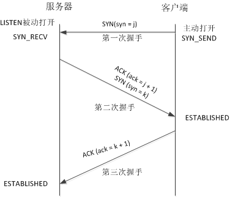
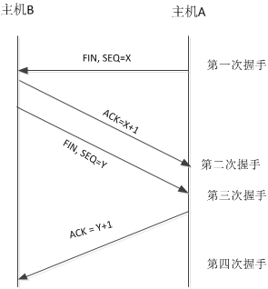

Tcp三次握手底层，ack和fin包是什么

从协议分层模型方面来讲，TCP/IP由四个层次组成：网络接口层、网络层、传输层、应用层 

		TCP：传输控制协议，是一种面向连接的、可靠的、基于字节流的传输层通信协议，由IETF的RFC 793 定义

		IETF：国际互联网工程任务组，是一个公开性质的大型民间国际团体，汇集了与互联网架构和互联网顺利运作相关的网络设计者、运营者、投资人和研究人员

Tcp协议进行三次握手：

第一次握手：主机向服务器发送请求，其中携带参数syn表示我要跟你建立连接

第二次握手：服务器接受到主机发送的请求，但是服务器不能保证主机可以接受到信息，这个时候就需要第三次握手，并且携带参数syn+ack服务器会周期性的超时重传，直到主机发出确认ack

第三次握手：A在发送完确认报文之后，单方面会进入ESTABLISHED的状态，B还是SYN_RCVD状态

如果此时双方都没有数据需要发送，B会周期性的超时发送(SYN+ACK)，直到收到A的确认报文(ACK)，此时B也进入ESTABLISHED状态，双方可以发送数据；

如果A有数据发送，A发送的是(ACK+DATA)，B会在收到这个数据包的时候自动切换到ESTABLISHED状态，并接受数据(DATA)；

如果这个时候B要发送数据，B是发送不了数据的，会周期性的超时重传(SYN+ACK)直到收到A的确认(ACK)B才能发送数据。

（1）SYN：同步序号

（2）ACK：应答回复

（3）RST：复位连接，消除旧有的同步序号

（4）PSH：尽可能的将数据送往接收进程

（5）FIN：发送方完成数据发送

（6）URG

TCP释放连接需四次挥手 
 

第一次挥手：主机A向主机B发送FIN包；A告诉B，我（A）发送给你（B）的数据大小是N，我发送完毕，请求断开A->B的连接。

第二次挥手：主机B收到了A发送的FIN包，并向主机A发送ACK包；B回答A，是的，我总共收到了你发给我N大小的数据，A->B的连接关闭。

第三次挥手：主机B向主机A发送FIN包；B告诉A，我（B）发送给你（A）的数据大小是M，我发送完毕，请求断开B->A的连接。

第四次挥手：主机A收到了B发送的FIN包，并向主机B发送ACK包；A回答B，是的，我收到了你发送给我的M大小的数据，B->A的连接关闭。
