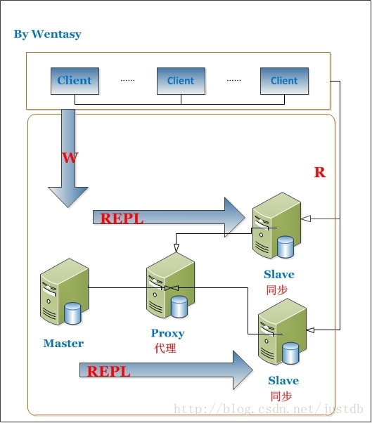

简述数据库读写分离

MySQL Proxy最强大的一项功能是实现“读写分离(Read/Write Splitting)”。基本的原理是让主数据库处理事务性查询，而从数据库处理SELECT查询。数据库复制被用来把事务性查询导致的变更同步到集群中的从数据库。 当然，主服务器也可以提供查询服务。使用读写分离最大的作用无非是环境服务器压力。可以看下这张图： 

 

读写分离的好处

1、增加冗余

2、增加了机器的处理能力

3、对于读操作为主的应用，使用读写分离是最好的场景，因为可以确保写的服务器压力更小，而读又可以接受点时间上的延迟。

读写分离提高性能之原因

1、物理服务器增加，负荷增加

2、主从只负责各自的写和读，极大程度的缓解X锁和S锁争用

3、从库可配置myisam引擎，提升查询性能以及节约系统开销

4、从库同步主库的数据和主库直接写还是有区别的，通过主库发送来的binlog恢复数据，但是，最重要区别在于主库向从库发送binlog是异步的，从库恢复数据也是异步的

5、读写分离适用与读远大于写的场景，如果只有一台服务器，当select很多时，update和delete会被这些select访问中的数据堵塞，等待select结束，并发性能不高。 对于写和读比例相近的应用，应该部署双主相互复制

6、可以在从库启动是增加一些参数来提高其读的性能，例如--skip-innodb、--skip-bdb、--low-priority-updates以及--delay-key-write=ALL。当然这些设置也是需要根据具体业务需求来定得，不一定能用上

7、分摊读取。假如我们有1主3从，不考虑上述1中提到的从库单方面设置，假设现在1分钟内有10条写入，150条读取。那么，1主3从相当于共计40条写入，而读取总数没变，因此平均下来每台服务器承担了10条写入和50条读取（主库不承担读取操作）。因此，虽然写入没变，但是读取大大分摊了，提高了系统性能。另外，当读取被分摊后，又间接提高了写入的性能。所以，总体性能提高了，说白了就是拿机器和带宽换性能。MySQL官方文档中有相关演算公式：官方文档 见6.9FAQ之“MySQL复制能够何时和多大程度提高系统性能”

8、MySQL复制另外一大功能是增加冗余，提高可用性，当一台数据库服务器宕机后能通过调整另外一台从库来以最快的速度恢复服务，因此不能光看性能，也就是说1主1从也是可以的。

读写分离示意图
 

