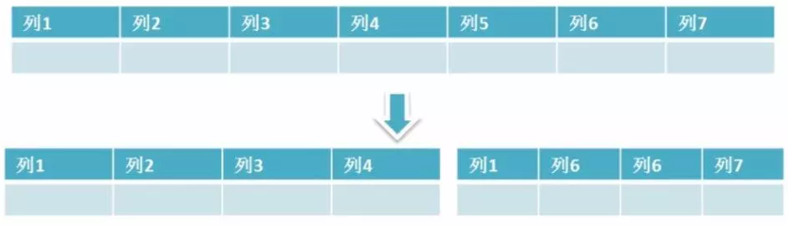
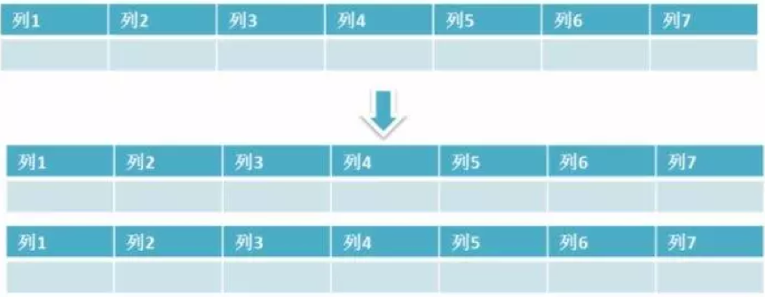
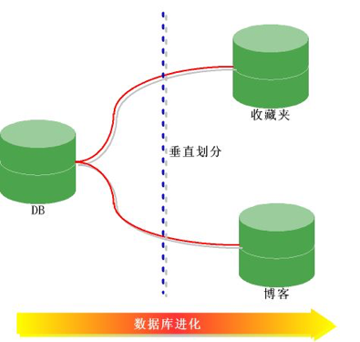
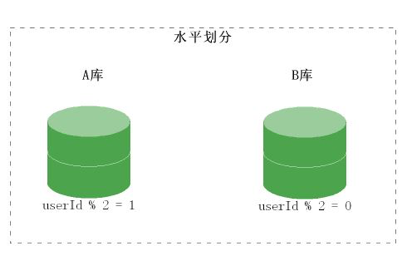

#Mysql 分表 分库 水平 垂直

1.	什么是mysql的分表 分库

	分表的两种分割方式：水平 垂直

a.	垂直分割：简单来说垂直拆分是指数据表列的拆分，把一张列比较多的表拆分为多张表。 垂直分割一般用于拆分大字段和访问频率低的字段，分离冷热数据。

b．水平分割：水平拆分是指数据表行的拆分，表的行数超过500万行或者单表容量超过10GB时，查询就会变慢，这时可以把一张的表的数据拆成多张表来存放。水平分表尽可能使每张表的数据量相当，比较均匀。

优势：

分表能够解决单表数据量过大带来的查询效率下降的问题

策略：
	对于互联网企业来说，大部分数据都是与用户关联的，因此，用户id是最常用的分表字段。因为大部分查询都需要带上用户ID，这样的分表策略既不会影响正常查询，又能够使数据较为均衡地分布到各个表中（有些场景可能会出现冷热数据分配不均衡的情况）。
	假设有一个用来记录用户购买信息的订单表（ORDER），由于ORDER表中的记录条数太多，需要被拆分为256张表（拆分表的数量一般是2的N次方），拆分的规则是根据USER_ID%256取得对应的表存储记录。而前台应用则能根据USER_ID%256的规则去找到对应订单存储的表，再去存储该记录的表中取出数据（余数为0，则查0号表，余数为233，则查233号表）。这样以来，USER_ID便变成了一个必须的查询条件，否则将会因为无法定位数据存储的表而无法对数据进行访问。

这时，如果要访问USER_ID是257的订单记录，则根据USER_ID%256的规则得到要访问的表是ORDER_1。这里可能会有个疑问，就是如果257这个用户特别有钱，下了一亿个订单，ORDER_1表岂不是又数据量过大了。当然这种情况现实是不可能出现的，但是这个疑问可以推出一个观点，就是说具体的分表策略是要根据实际情况来制定的。

 
	分库的两种分割方式：水平 垂直	
a. 垂直分割：按照功能划分，把数据分别放到不同的数据库和服务器。

b.水平分割: 一个表的数据划分到不同的数据库，两个数据库的表结构一样

作用：

提高并发数据库处理数据的能力

策略

与分表策略类似，分库也可以采用通过一个关键字取模的方式来对数据访问进行路由。比如还是之前的订单表，假设USER_ID字段的值是258，将原有的单库分为256个库，那么应用程序对数据库的访问请求将被路由到第二个库（258%256 = 2）。

2.	 为什么要分表,分库？

	分表
a.如果一个表的每条记录的内容很大，那么就需要更多的IO操作，如果字段值比较大，而使用频率相对比较低，可以将大字段移到另一张表中，当查询不查大字段的时候，这样就减少了I/O操作

b.如果一个表的数据量很少，那么查询就很快；如果表的数据量非常非常大，那么查询就变的比较慢；也就是表的数据量影响这查询的性能。

c.表中的数据本来就有独立性，例如分别记录各个地区的数据或者不同时期的数据，特别是有些数据常用，而另外一些数据不常用。

	分库：一旦分表，一个库中的表会越来越多，这时需要分成多个数据库
a. 每个物理数据库支持数据都是有限的，每一次的数据库请求都会产生一次数据库链接，当一个库无法支持更多访问的时候，我们会把原来的单个数据库分成多个，帮助分担压力。

3.	应用场景？

	垂直分表：
	a．例如博客系统中的文章表，比如文章tbl_articles(id, titile, summary, content, user_id, create_time)，因为文章中的内容content字段可能会比较长，如果放在tbl_articles中会严重影响文章表的查询速度，所以将内容放到tbl_articles_detail(article_id, content)，像文章列表只需要查询tbl_articles中的字段即可，如果想要查询文章的具体内容就关联tbl_articles_detail，

b.像我们经常看到的tbl_order表有对应的tbl_order_detail, 就是减少order字段的数量，将一些使用频率相对较低的放在detail详情表中

	水平分表：

a.针对数据量巨大的单张表（比如订单表），按照某种规则（RANGE,HASH取模等），切分到多张表里面去。电话账单就可以分成多个表：最近3个月的账单数据存在一个表，3个月前的历史账单存放到另一种表，超过一年的历史账单可以存储到单独的存储介质上，这种拆分是最常用的水平拆分方法。

	垂直分库：

a．	可以按照业务分为资金、会员、订单三个数据库。
	水平分库：
a.	例如，大部分的站点。数据都是和用户有关，那么可以根据用户，将数据按照用户水平拆分。

4.	分表 分库的优缺点？

分表的优点： 可以使得行数据变小，在查询时减少读取的Block数，减少I/O次数。此外，垂直分区可以简化表的结构，易于维护。

分表的缺点： 主键会出现冗余，需要管理冗余列，并会引起Join操作，可以通过在应用层进行Join来解决。此外，垂直分区会让事务变得更加复杂。
水平分库分表的优点：水平分库分表能够有效的缓解单机和单库的性能瓶颈和压力，突破IO、连接数、硬件资源等的瓶颈。

分库的优点：实现简单，库与库之间界限分明，便于维护

分库的缺点：不利于频繁跨库操作，单表数据量大的问题解决不了。数据库事务管理困难。如果依赖数据库本身的分布式事务管理功能去执行事务，将付出高昂的性能代价；如果由应用程序去协助控制，形成程序逻辑上的事务，又会造成编程方面的负担。额外的数据管理负担和数据运算压力。
