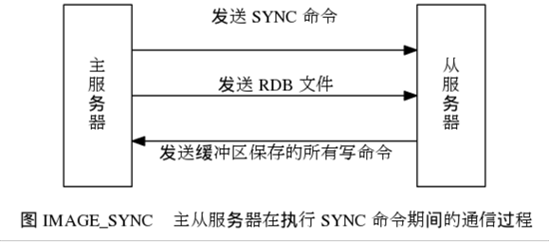
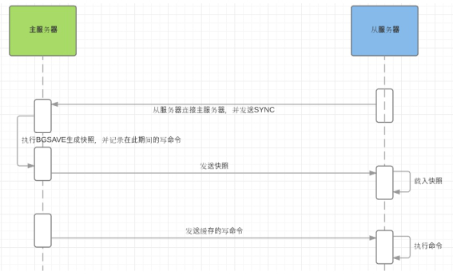

Redis的主从复制策略是通过其持久化的rdb文件来实现的，其过程是先dump出rdb文件，将rdb文件全量传输给slave，然后再将dump后的操作实时同步到slave中。让从服务器(slave server)成为主服务器(master server)的精确复制品。官方文档ReplicationHowto中提到以下特点：

一个master支持多个slave，slave可以接受其他slave的连接，作为其他slave的master，从而形成一个master-slave的多级结构

复制功能不会阻塞主服务器： 即使有一个或多个从服务器正在进行初次同步， 主服务器也可以继续处理命令请求。复制功能不会阻塞从服务器： 只要在 redis.conf 文件中进行了相应的设置， 即使从服务器正在进行初次同步， 服务器也可以使用旧版本的数据集来处理命令查询。不过， 在从服务器删除旧版本数据集并载入新版本数据集的那段时间内， 连接请求会被阻塞。

复制被利用来提供可扩展性，比如可以将slave端用作数据冗余，也可以将耗时的命令（比如sort）发往某些slave从而避免master的阻塞，另外也可以用slave做持久化，由从服务器去执行持久化操作，这只需要将master的配置文件中的save指令注释掉。

Redis 使用异步复制。 从 Redis 2.8 开始， 从服务器会以每秒一次的频率向主服务器报告复制流的处理进度。

复制功能的实现

redis的主从复制分为两个阶段：

1）同步操作：将从服务器的数据库状态更新至主服务器当前所处的数据库状态。

2）命令传播：在主服务器的数据库状态被修改，导致主从服务器的数据库状态出现不一致时，让主从服务器重新回到一致状态。

同步

当客户端向从服务器发送 SLAVEOF 命令， 要求从服务器复制主服务器时， 从服务器首先需要执行同步操作， 也即是， 将从服务器的数据库状态更新至主服务器当前所处的数据库状态。

从服务器对主服务器的同步操作需要通过向主服务器发送 SYNC 命令来完成， 以下是 SYNC 命令的执行步骤：

从服务器向主服务器发送 SYNC 命令。

收到 SYNC 命令的主服务器执行 BGSAVE 命令， 在后台生成一个 RDB 文件， 并使用一个缓冲区记录从现在开始执行的所有写命令。

当主服务器的 BGSAVE 命令执行完毕时， 主服务器会将 BGSAVE 命令生成的 RDB 文件发送给从服务器， 从服务器接收并载入这个 RDB 文件， 将自己的数据库状态更新至主服务器执行 BGSAVE 命令时的数据库状态。

主服务器将记录在缓冲区里面的所有写命令发送给从服务器， 从服务器执行这些写命令， 将自己的数据库状态更新至主服务器数据库当前所处的状态。

下图展示了 SYNC 命令执行期间， 主从服务器的通信过程：

命令传播
在同步操作执行完毕之后， 主从服务器两者的数据库达到一致状态， 但这种一致并不是一成不变的。当主服务器执行客户端发送的写命令时，主服务器的数据库就有可能会被修改， 并导致主从服务器状态不再一致。为了让主从服务器再次回到一致状态，主服务器需要对从服务器执行命令传播操作： 主服务器会将自己执行的写命令 ―― 即造成主从服务器不一致的那条写命令发送给从服务器执行， 当从服务器执行了相同的写命令之后， 主从服务器将再次回到一致状态。但是这样的复制功能有缺陷：在主从服务器断线重连之后执行同步动作时，生成完整的RDB文件并且发送到从服务器载入，但主从服务器的数据库状态在断线前基本上是一致的，不一致的部分只有断线后主服务器执行那一部分修改数据库的命令，所以这时SYNC命令就非常浪费，因为生成RDB文件时一个非常消耗CPU、内存和IO资源的过程，发送RDB文件到从服务器会占用大量的网络带宽资源，从服务器在载入RDB文件的过程中会阻塞不会响应任何命令，所以大部分情况下执行SYNC命令是没有必要也是非常不合理的。

为了解决2.8之前版本SYNC命令的性能问题，2.8版本设计了一个新的命令PSYNC，PSYNC命令分为 完整重同步 和 部分重同步 ，完整重同步过程用于从服务器初始化时初次复制的情况和SYNC命令基本一致，PSYNC则用于断线后重新复制，在条件允许的情况下，它不会生成RDB文件，而是给从服务器回复一个+Continue表示执行部分重同步，并且把从服务器断线后主服务器执行的修改数据库的命令发送到从服务器，从服务器执行这些命令同步数据库。

部分重同步功能由下面几个部分构成：

主服务器的复制偏移量 和 从服务器的复制偏移量 ：当主服务器在向从服务器进行命令同步时，主服务器和从服务器会各自记录一个复制偏移量，当主从服务器的数据库状态一致时这两个复制偏移量是相同的，如果这两个偏移量不一致说明当前主从服务器的状态不一致。

主服务器的复制积压缓冲区 ：复制积压缓冲区是一个固定大小的FIFO队列，当队列已满时会弹出最早插入的数据，在主服务器进行命令传播时会同时把命令放到缓冲区中，缓冲区包含两部分数据，偏移量和字节。在进行复制时从服务器会将偏移量上报到主服务器，主服务检查当前偏移量是否还存在缓冲区中，如果存在进行部分重同步，如果不存在进行完整重同步。因为这个积压缓冲区是一个固定大小的队列，所以当从服务器长时间断线时，从服务器的复制偏移量很可能已不再缓冲区中，这时候只能进行完整重同步。

服务器的运行ID ：初次同步时主服务器会把ID发给从服务器，从服务器保存主服务器ID，当断线重连后，会把之前保存的主服务器ID上报给主服务器，主服务器检查从服务器之前复制的主服务器ID是否和自己的ID相同，如果相同，执行部分重同步，如果不同说明从服务器之前记录的状态不是当前主服务器，这时候需要执行完整重同步。

PSYNC命令实现

初始复制或者之前执行过SLAVEOF no one命令，执行完整重同步：发送PSYNC ? -1命令到主服务器。如果从服务器已经复制过某个主服务器，在开始新复制时向主服务器发送PSYNC <runid> <offset>命令，runid是上次复制的主服务器id，offset是从服务器的复制偏移量，主服务器会根据这个两个参数来决定做哪种同步，判断服务器id是否和本机相同，复制偏移量是否在缓冲区中，主服务器有三种回复：

回复+FULLRESYNC <runid> <offset>执行完整重同步，从服务器把offset当做初始复制偏移量

回复+CONTINUE，表示执行部分重同步，从服务器等待主服务器发送缺少的数据

回复-ERR，表示主服务器版本低于2.8，不支持PSYNC命令

新版本复制过程：

设置主服务器地址和端口，通过调用SAVEOF <master_ip> <master_port>命令。

建立套接字连接。

发送PING命令，检查主从服务器是否能够正常处理命令。

身份验证，从服务器设置了masterauth并且主服务器设置了requirepass是需要进行身份验证。这两个选项要么都设置要么都不设置，如果只设置了一个从服务器向主服务器发送命令时会报错。

发送端口信息，通过执行命令REPLCONF listening-port <port-number>，向主服务器发送从服务器的监听端口号。

同步，从服务器向主服务器发送PSYNC命令。

命令传播，完成同步之后主服务器会把之后执行的写命令传播到从服务器保证主从服务器的状态一致。

心跳检测

在命令传播阶段，从服务器默认每秒一次的频率向主服务器发送命令：REPLCONF ACK <replication_offset>，replication_offset是从服务器的复制偏移量，该命令有三个作用：

检测从服务器的网络连接状态，检测主从服务器连接是否正常，如果主服务器超过一定时间没有收到从服务器的REPLCONF ACK 命令，那么它们的连接可能出了问题。

辅助实现min-slaves选项，min-slaves-to-write和min-slaves-max-lag两个选项可以防止主服务器在不安全的情况下执行写命令，min-slaves-to-write 3 min-slaves-max-lag 10 表示如果从服务器少于3个，或者3个从服务器的延迟都大于10秒时，主服务器拒绝写命令。

检测命令丢失，主服务器接收到从服务器的REPLCONF ACK 命令之后会检查从服务器的偏移量是否和主服务器的一致，如果不一致会把积压缓冲区中的从服务器偏移量后面的命令发送到从服务器。

关闭主服务器持久化时，复制功能的数据安全

当配置Redis复制功能时，强烈建议打开主服务器的持久化功能。 否则的话，由于延迟等问题，部署的服务应该要避免自动拉起。为了帮助理解主服务器关闭持久化时自动拉起的危险性，参考一下以下会导致主从服务器数据全部丢失的例子：

假设节点A为主服务器，并且关闭了持久化。 并且节点B和节点C从节点A复制数据

节点A崩溃，然后由自动拉起服务重启了节点A. 由于节点A的持久化被关闭了，所以重启之后没有任何数据

节点B和节点C将从节点A复制数据，但是A的数据是空的， 于是就把自身保存的数据副本删除。

在关闭主服务器上的持久化，并同时开启自动拉起进程的情况下，即便使用Sentinel来实现Redis的高可用性，也是非常危险的。 因为主服务器可能拉起得非常快，以至于Sentinel在配置的心跳时间间隔内没有检测到主服务器已被重启，然后还是会执行上面的数据丢失的流程。无论何时，数据安全都是极其重要的，所以应该禁止主服务器关闭持久化的同时自动拉起。

只读从服务器

从 Redis 2.6 开始， 从服务器支持只读模式， 并且该模式为从服务器的默认模式。

只读模式由 redis.conf 文件中的 slave-read-only 选项控制， 也可以通过 CONFIG SET 命令来开启或关闭这个模式。

只读从服务器会拒绝执行任何写命令， 所以不会出现因为操作失误而将数据不小心写入到了从服务器的情况。

即使从服务器是只读的， DEBUG 和 CONFIG 等管理式命令仍然是可以使用的， 还是不应该将服务器暴露给互联网或者任何不可信网络。 不过， 使用 redis.conf 中的命令改名选项， 可以通过禁止执行某些命令来提升只读从服务器的安全性。

一些不重要的临时数据， 仍然是可以保存在从服务器上面的。 比如说， 客户端可以在从服务器上保存主服务器的可达性信息， 从而实现故障转移策略。所以仍然要让一个从服务器变得可写。

从服务器相关配置

如果主服务器通过 requirepass 选项设置了密码， 那么为了让从服务器的同步操作可以顺利进行， 我们也必须为从服务器进行相应的身份验证设置。

对于一个正在运行的服务器， 可以使用客户端输入以下命令：

config set masterauth <password>

要永久地设置这个密码， 那么可以将它加入到配置文件中：

masterauth <password>

详细的信息可以参考 Redis 源码中附带的redis.conf 示例文件。

主服务器只在有至少 N 个从服务器的情况下，才执行写操作

从 Redis 2.8 开始， 为了保证数据的安全性， 可以通过配置， 让主服务器只在有至少 N 个当前已连接从服务器的情况下， 才执行写命令。不过， 因为 Redis 使用异步复制， 所以主服务器发送的写数据并不一定会被从服务器接收到， 因此， 数据丢失的可能性仍然是存在的。以下是这个特性的运作原理：

从服务器以每秒一次的频率 PING 主服务器一次， 并报告复制流的处理情况。

主服务器会记录各个从服务器最后一次向它发送 PING 的时间。

用户可以通过配置， 指定网络延迟的最大值 min-slaves-max-lag ， 以及执行写操作所需的至少从服务器数量 min-slaves-to-write 。

如果至少有 min-slaves-to-write 个从服务器， 并且这些服务器的延迟值都少于 min-slaves-max-lag 秒， 那么主服务器就会执行客户端请求的写操作。你可以将这个特性看作 CAP 理论中的 C 的条件放宽版本： 尽管不能保证写操作的持久性， 但起码丢失数据的窗口会被严格限制在指定的秒数中。

如果条件达不到 min-slaves-to-write 和 min-slaves-max-lag 所指定的条件， 那么写操作就不会被执行， 主服务器会向请求执行写操作的客户端返回一个错误。

以下是这个特性的两个选项和它们所需的参数：

min-slaves-to-write <number of slaves>
min-slaves-max-lag <number of seconds>

Redis可扩展集群搭建

1. 主动复制避开Redis复制缺陷。

既然Redis的复制功能有缺陷，不妨放弃Redis本身提供的复制功能，我们可以采用主动复制的方式来搭建我们的集群环境。所谓 主动复制 是指由业务端或者通过代理中间件对Redis存储的数据进行双写或多写，通过数据的多份存储来达到与复制相同的目的，主动复制不仅限于 用在Redis集群上，目前很多公司采用主动复制的技术来解决MySQL主从之间复制的延迟问题，比如Twitter还专门开发了用于复制和分区的中间件gizzard( https://github.com/twitter/gizzard ) 。

主动复制虽然解决了被动复制的延迟问题，但也带来了新的问题，就是数据的一致性问题，数据写2次或多次，如何保证多份数据的一致性呢？如果你的应用 对数据一致性要求不高，允许最终一致性的话，那么通常简单的解决方案是可以通过时间戳或者vector clock等方式，让客户端同时取到多份数据并进行校验，如果你的应用对数据一致性要求非常高，那么就需要引入一些复杂的一致性算法比如Paxos来保证 数据的一致性，但是写入性能也会相应下降很多。

通过主动复制，数据多份存储我们也就不再担心Redis单点故障的问题了，如果一组Redis集群挂掉，我们可以让业务快速切换到另一组Redis上，降低业务风险。

2. 通过presharding进行Redis在线扩容。

通过主动复制我们解决了Redis单点故障问题，那么还有一个重要的问题需要解决：容量规划与在线扩容问题。我们前面分析过Redis的适用场景是全部数据存储在内存中，而内存容量有限，那么首先需要根据业务数据量进行初步的容量规划，比如你的业务数据需 要100G存储空间，假设服务器内存是48G，至少需要3~4台服务器来存储。这个实际是对现有 业务情况所做的一个容量规划，假如业务增长很快，很快就会发现当前的容量已经不够了，Redis里面存储的数据很快就会超过物理内存大小，如何进行 Redis的在线扩容呢？Redis的作者提出了一种叫做presharding的方案来解决动态扩容和数据分区的问题，实际就是在同一台机器上部署多个Redis实例的方式，当容量不够时将多个实例拆分到不同的机器上，这样实际就达到了扩容的效果。

拆分过程如下：

在新机器上启动好对应端口的Redis实例。

配置新端口为待迁移端口的从库。

待复制完成，与主库完成同步后，切换所有客户端配置到新的从库的端口。

配置从库为新的主库。

移除老的端口实例。

重复上述过程迁移好所有的端口到指定服务器上。

以上拆分流程是Redis作者提出的一个平滑迁移的过程，不过该拆分方法还是很依赖Redis本身的复制功能的，如果主库快照数据文件过大，这个复制的过程也会很久，同时会给主库带来压力。所以做这个拆分的过程最好选择为业务访问低峰时段进行。

新浪微博的replication改进思路：

首先写Redis的AOF文件，并对这个AOF文件按文件大小进行自动分割滚动，同时关闭Redis的Rewrite命令，然后会在业务低峰时间进行内存快照存储，并把当前的AOF文件位置一起写入到快照文件中，这样我们可以使快照文件与AOF文件的位置保持一致性，这样我们得到了系统某一时刻的内存快照，并且同时也能知道这一时刻对应的AOF文件的位置，那么当从库发送同步命令时，我们首先会把快照文件发送给从库，然后从库会取出该快照文件中存储的AOF文件位置，并将该位置发给主库，主库会随后发送该位置之后的所有命令，以后的复制就都是这个位置之后的增量信息了。

Redis的复制由于会使用快照持久化方式，所以如果Redis持久化方式选择的是日志追加方式(aof),那么系统有可能在同一时刻既做aof日志文件的同步刷写磁盘，又做快照写磁盘操作，这个时候Redis的响应能力会受到影响。所以如果选用aof持久化，则加从库需要更加谨慎。

总结

Master最好不要做任何持久化工作，包括内存快照和AOF日志文件，特别是不要启用内存快照做持久化。

如果数据比较关键，某个Slave开启AOF备份数据，策略为每秒同步一次。

为了主从复制的速度和连接的稳定性，Slave和Master最好在同一个局域网内。

尽量避免在压力较大的主库上增加从库

为了Master的稳定性，主从复制不要用图状结构，用单向链表结构更稳定，即主从关系为：Master<�CSlave1<�CSlave2<�CSlave3…….，这样的结构也方便解决单点故障问题，实现Slave对Master的替换，也即，如果Master挂了，可以立即启用Slave1做Master，其他不变。

'创建6379和6380配置文件'
redis.conf：6379为默认配置文件，作为Master服务配置；
redis_6380.conf：6380为同步配置，作为Slave服务配置；
'配置slaveof同步指令'
在Slave对应的conf配置文件中，添加以下内容：
slaveof 127.0.0.1 6379

数据同步步骤：
(1)Slave服务器连接到Master服务器.
(2)Slave服务器发送同步(SYCN)命令.
(3)Master服务器备份数据库到文件.
(4)Master服务器把备份文件传输给Slave服务器.
(5)Slave服务器把备份文件数据导入到数据库中.