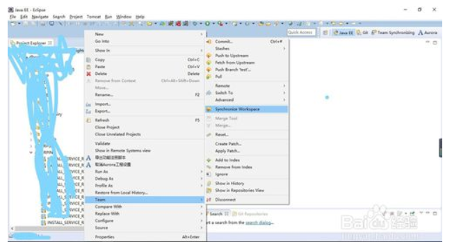

Git如何解决冲突？

git冲突是我们在开发最常见的情况之一，解决不好的情况下，很容易出现错误
或者导致代码提交不上去。下面就来教大家怎么解决git冲突

第一步: 首先我们文件如果有冲突的情况下，文件会显示红色。然后我们鼠标移到项目目录
上点击右键，选择到team这个栏上。这一栏是git的属性和处理方式。然选择到同步工作
间也就是synchronize workspace

然后我们会进入到解决冲突的界面。然后我们点击双向红箭头的位置，这个意思显示所有有冲突的文件
这样的目的是让我们更直观的2文件冲突有些

然后选择我们需要修改冲突的文件，然后鼠标点击右键，选择merge tool，然后右下角会出现两个代码对比界面。记住左边的代码是服务器最新的代码，而右边就是你自己的代码，这时候你需要去对比服务器代码和你的代码哪里不一致然后修改放在左边保存

保存之后，我们再选择到冲突文件依然是点击鼠标右键选择add to index 将代码合并，

合并之后，再次点击右键选择commit提交代码，注意再提交代码的时候这个过程稍微会比较长,待提交完成之后我们会发现项目会有待推箭头。当我们看到这个待推箭头的时候就说明冲突已经解决了

