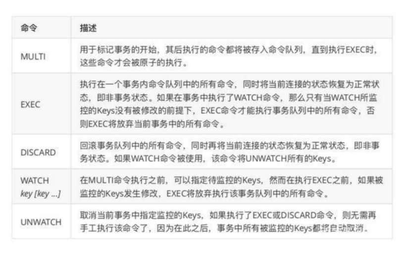
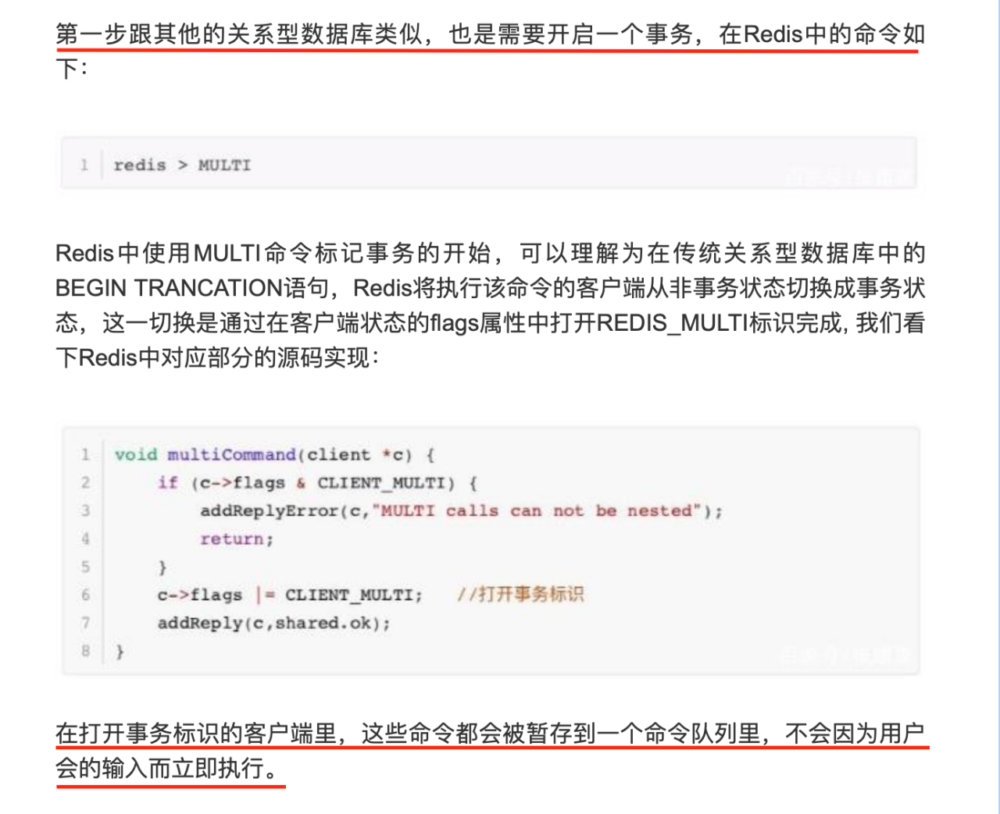
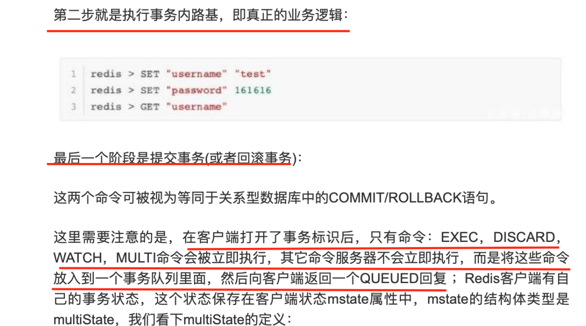

#redis 事物

redis事务简介

Redis事务通常会使用MULTI,EXEC,WATCH等命令来完成，redis事务实现的机制与常见的关系型数据库有很大的区别，比如redis的事务不支持回滚,事务执行时会阻塞其它客户端的请求执行。

事务实现细节

redis事务从开始到结束通常会通过三个阶段: 

    1.事务开始

    2.命令入队

    3.事务执行

Redis中事物相关的指令：

和关系型数据库中的事物相比，在redis事物中如果有某一条命令执行失败，其后的命令仍然会被继续执行

redis事务的ACID特性：

1.原子性 

事务具有原子性指的是，数据库将事务中的多个操作当作一个整体来执行，服务器要么就执行事务中的所有操作，要么就一个操作也不执行。 但是对于redis的事务功能来说，事务队列中的命令要么就全部执行,要么就一个都不执行，因此redis的事务是具有原子性的。

我们通常会知道 两种关于redis事务原子性的说法，一种是要么事务都执行，要么都不执行。另外一种说法是redis事务当事务中的命令执行失败后面的命令还 会执行，错误之前的命令redis不支持事务的回滚机制,即使事务队列中的某个命令在执行期间出现错误,整个事务也会继续执行下去,直到将事务队列中的所有命令都执行完毕为止

需要注意的是: 

    1).Redis的事务没有关系数据库事务提供的回滚（rollback），所以开发者必须在事务执行失败后进行后续的处理； 

    2).如果在一个事务中的命令出现错误，那么所有的命令都不会执行； 

    3).如果在一个事务中出现运行错误，那么正确的命令会被执行。

2.一致性 

事务具有一致性指的是，如果数据库在执行事务之前是一致的，那么在事务执行之后，无论事务是否执行成功,数据库也应该仍然一致的。 

”一致“指的是数据符合数据库本身的定义和要求，没有包含非法或者无效的错误数据。redis通过谨慎的错误检测和简单的设计来保证事务一致性。

3.隔离性 

事务的隔离性指的是，即使数据库中有多个事务并发在执行，各个事务之间也不会互相影响，并且在并发状态下执行的事务和串行执行的事务产生的结果完全相同。 

因为redis使用单线程的方式来执行事务(以及事务队列中的命令)，并且服务器保证，在执行事务期间不会对事物进行中断，因此，redis的事务总是以串行的方式运行的，并且事务也总是具有隔离性的 。

4.持久性 

事务的耐久性指的是，当一个事务执行完毕时，执行这个事务所得的结果已经被保持到永久存储介质里面。
  
因为redis事务不过是简单的用队列包裹起来一组redis命令，redis并没有为事务提供任何额外的持久化功能，所以redis事务的耐久性由redis使用的模式决定。

- 当服务器在无持久化的内存模式下运行时，事务不具有耐久性，一旦服务器停机，包括事务数据在内的所有服务器数据都将丢失； 

- 当服务器在RDB持久化模式下运作的时候，服务器只会在特定的保存条件满足的时候才会执行BGSAVE命令,对数据库进行保存操作，并且异步执行的BGSAVE不能保证事务数据被第一时间保存到硬盘里面,因此RDB持久化模式下的事务也不具有耐久性；

- 当服务器运行在AOF持久化模式下，并且appedfsync的选项的值为always时，程序总会在执行命令之后调用同步函数，将命令数据真正的保存到硬盘里面,因此这种配置下的事务是具有耐久性的； 

- 当服务器运行在AOF持久化模式下，并且appedfsync的选项的值为everysec时，程序会每秒同步一次命令数据到磁盘因为停机可能会恰好发生在等待同步的那一秒内，这种可能造成事务数据丢失，所以这种配置下的事务不具有耐久性

五、redis事务执行流程：

